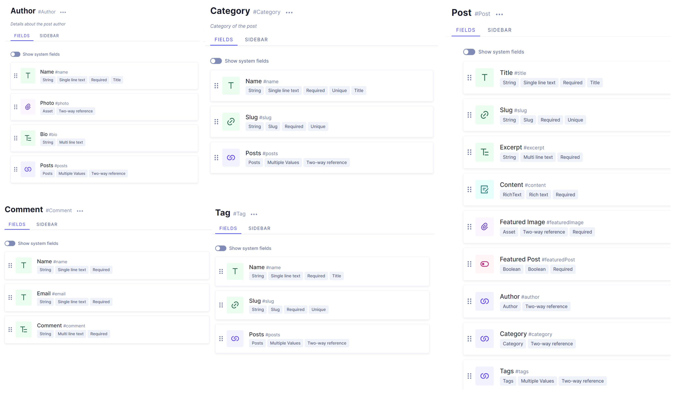
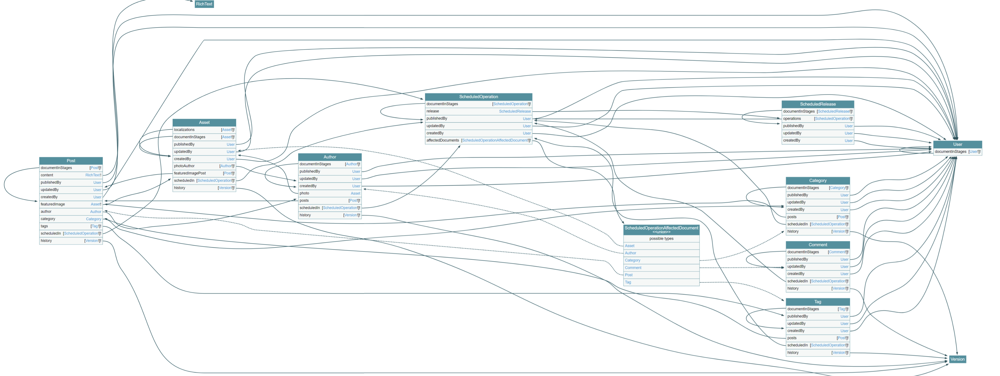

# Portfolio

This is a personal blog + portfolio website built with NextJS, deployed on vercel\
\


# Development setup

Fork this repo and clone it. Complete config/site.js.

## GraphCMS (for blog)

Sign up on [Hygraph](https://hygraph.com/) and get a Public Content API Key. The Schema is described as follows:



## SendGrid (for email in contact form)

Sign up on [SendGrid](https://app.sendgrid.com/) and get an [API Key](https://app.sendgrid.com/guide/integrate/langs/nodejs)

## Dotenv

Create a `.env.local` file, and define the variables `HYGRAPH_ENDPOINT`, `SENDGRID_API_KEY`, and `EMAIL`

## Running the website locally

First, run the development server:

```bash
npm run dev
```

Open [http://localhost:3000](http://localhost:3000) with your browser to see the result.
